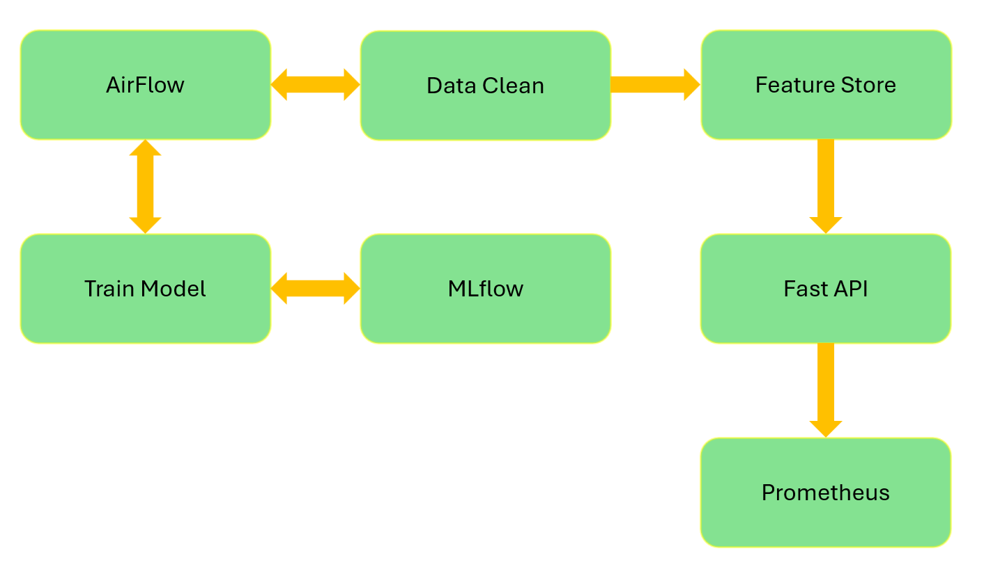
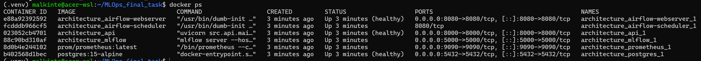
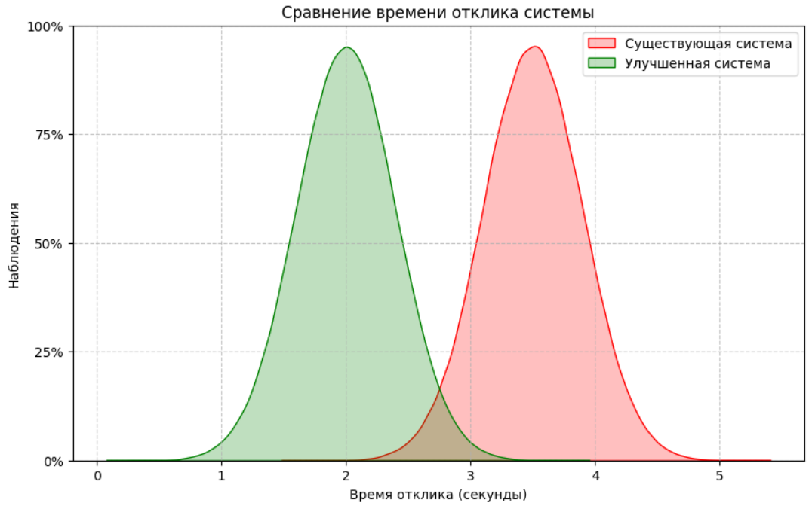

Репо: [https://github.com/EgrSlv/MLOps_final_task](https://github.com/EgrSlv/MLOps_final_task)

Облако: [https://mlops-finaltask-titanicml-api.containerapps.ru](https://mlops-finaltask-titanicml-api.containerapps.ru)

Автор: **Соловьев Егор (М08-501НД)**

# ML-система предсказания выживаемости на Титанике

## Быстропроверки
**Локальный запуск:**
```
docker-compose -f architecture/docker-compose.yml up -d --build
```

```
docker-compose -f architecture/docker-compose.yml down -v
```

```
docker ps
```

```
curl localhost:8000/health  # {"status":"healthy","model_loaded":true}
```

**Проверки**
```
# Одиночное предсказание
curl -X POST localhost:8000/predict -H "Content-Type: application/json" -d

# '{"Pclass":3,"Sex":"male","Age":25.0,"SibSp":0,"Parch":0,"Fare":7.25,"Embarked":"S"}'
```

```
# Batch предсказание
curl -X POST localhost:8000/predict/batch -H "Content-Type: application/json" -d '[{"Pclass":3,"Sex":"male","Age":25.0,"SibSp":0,"Parch":0,"Fare":7.25,"Embarked":"S"},{"Pclass":1,"Sex":"female","Age":30.0,"SibSp":1,"Parch":0,"Fare":100.0,"Embarked":"C"}]'

```

```
# Prometheus метрики
curl localhost:8000/metrics
```

```
# Cloud.ru
curl https://mlops-finaltask-titanicml-api.containerapps.ru/health
```

```
# Cloud.ru
curl https://mlops-finaltask-titanicml-api.containerapps.ru/predict -X POST -H "Content-Type: application/json" -d '{"Pclass":3,"Sex":"male","Age":25.0,"SibSp":0,"Parch":0,"Fare":7.25,"Embarked":"S"}'
```

```
# Airflow
http://localhost:8080
```

```
# Тесты
python -m pytest tests/ -v
```

## Уровень зрелости ML-системы

Выбран **Уровень 2 (ML Automation)** согласно [классификации Google Cloud MLOps](https://docs.cloud.google.com/architecture/mlops-continuous-delivery-and-automation-pipelines-in-machine-learning), так как система обеспечивает:

| Критерий | Реализация |
|---|---|
| Версионирование кода | Git |
| CI/CD пайплайн выкатки модели | Docker Compose |
| Feature store | PostgreSQL |
| Сервинг модели через API | FastAPI + Uvicorn |
| Мониторинг качества предсказаний | Prometheus + custom метрики |
| Система управления экспериментами | MLflow Tracking |
| Оркестратор пайплайнов | Apache Airflow |
| Инфраструктура как код (IaC) | Docker Compose |
| Микросервисная архитектура | Docker Compose (7 сервисов) |

---

## ML-манифест

### 1. Предыстория

**Заказчик:** Туристическая компания, организующая круизы.

**Проблема:** Компания хочет разработать систему оценки рисков для пассажиров круизных лайнеров в чрезвычайных ситуациях. Исторические данные по Титанику показывают, что выживаемость зависит от множества факторов (класс каюты, пол, возраст, порт посадки и т.д.). Заказчику нужен инструмент, который по характеристикам пассажира предсказывает вероятность выживания для планирования спасательных мероприятий и оптимизации страховых программ.

### 2. Ценностное предложение

Система позволяет:
- Автоматически оценивать риск для каждого пассажира на основе исторических данных
- Своевременно выявлять пассажиров групп риска для дополнительного инструктажа
- Оптимизировать страховые тарифы на основе объективных ML-оценок
- Сократить время принятия решений с часов до миллисекунд через API

### 3. Цели

1. Разработать пайплайн очистки и подготовки данных
2. Обучить модель бинарной классификации (выжил/не выжил) с качеством Accuracy ≥ 0.80
3. Предоставить API для получения предсказаний в реальном времени
4. Настроить мониторинг дрейфа данных и качества модели
5. Автоматизировать переобучение модели при ухудшении метрик
6. Обеспечить переключение трафика между версиями модели

### 4. Решение

**Архитектура:** Микросервисная, 7 компонентов:




| Компонент | Роль | Технология |
|---|---|---|
| **Оркестратор** | Управляет пайплайнами данных и обучения | Apache Airflow |
| **Data Cleaning** | Очистка Titanic-датасета (пропуски, категоризация) | pandas + sklearn |
| **Feature Store** | Хранение и версионирование признаков | PostgreSQL |
| **Experiment Tracking** | Логирование метрик, параметров, артефактов | MLflow |
| **Model Training** | Обучение Random Forest Classifier | sklearn |
| **API Serving** | REST API для инференса модели | FastAPI + Uvicorn |
| **Monitoring** | Метрики качества предсказаний и дрейфа | Prometheus |
| **IaC** | Инфраструктура как код | Docker Compose |


**Фичи продукта:**
- REST API для инференса модели (`/predict`, `/predict/batch`, `/health`)
- Автоматический пайплайн переобучения по расписанию
- Хранение признаков в feature store
- Эксперимент-трекинг через MLflow
- Мониторинг точности и дрейфа данных
- Graceful traffic switching между версиями модели

**Ограничения:**
- Не реализовал A/B тестирования на уровне инфраструктуры

**Что НЕ входит:**
- Web UI для бизнес-пользователей
- Мобильное приложение
- Поддержка мультиязычности

### 5. Осуществимость

**Ресурсы:**
- Python 3.13 с библиотеками sklearn, pandas, fastapi, mlflow, airflow
- Docker и Docker Compose для контейнеризации
- Бесплатные компоненты с открытым исходным кодом

**Риски:**
- Docker требует ~4GB RAM для всех 6 сервисов
- Airflow требует PostgreSQL (дополнительный сервис)
- Titanic dataset мал для production, но достаточен для демонстрации

### 6. Данные

**Обучающий набор:** [Titanic dataset](https://raw.githubusercontent.com/datasciencedojo/datasets/master/titanic.csv)

**Признаки:**
- Числовые: Age, Fare, SibSp, Parch
- Категориальные: Sex, Embarked, Pclass
- Текстовые: Name, Ticket, Cabin

**Реальный набор:** Эмулируется через запросы к API - те же признаки, подаваемые пользователем.

**Разметка:** Целевая переменная `Survived` (0/1) размечена исторически - дополнительная разметка не требуется.

### 7. Метрики

**Бизнес-метрики:**
- Доля корректно оценённых рисков (Accuracy на исторических данных) - target ≥ 80%
- Время ответа API - target < 500ms (p95)

**ML-метрики:**
- Accuracy, Precision, Recall, F1-score
- ROC-AUC

### 8. Оценка качества модели

**Офлайн-метрики:** Вычисляются на отложенной тестовой выборке (20%) после каждого тренировочного цикла. Фиксируются в MLflow.

**Онлайн-метрики:** Мониторинг распределения предсказаний (доля выживших), мониторинг входных признаков (data drift), задержка инференса.

### 9. Подбор модели

Итеративный подход:
1. **Baseline:** Logistic Regression (простейшая интерпретируемая модель)
2. **Улучшение:** Random Forest Classifier
3. **Оптимизация:** Random Forest Classifier с подбором гиперпараметров через GridSearchCV

Итоговая модель выбирается по ROC-AUC на кросс-валидации (5-fold).

### 10. Инференс

**Режим:** Синхронный REST API на FastAPI

**Поток:**
1. Клиент отправляет POST-запрос на `/predict` с признаками пассажира
2. API загружает последнюю версию модели
3. Feature store обогащает запрос (при необходимости)
4. Модель вычисляет вероятность выживания
5. Возвращается JSON-ответ с предсказанием

### 11. Обратная связь

**Источники обратной связи:**
- Логи API-запросов (сохраняются в PostgreSQL)
- Мониторинг метрик (Prometheus)
- MLflow метрики при переобучении

**MDD:** Используется Metrics Driven Development для принятия решений о переключении трафика между версиями модели. Решения фиксируются в Cloud.ru

### 12. Управление проектом

**Конечные результаты:**
- [Git-репозиторий с кодом](https://github.com/EgrSlv/MLOps_final_task)
- [Docker Compose для локального запуска](architecture/docker-compose.yml)
- Документация (Ниже в Readme.md)


---

## Микросервисная архитектура

```
architecture/
├── docker-compose.yml         # Локальный запуск (6 сервисов)
└── prometheus.yml             # Monitoring config

src/
├── data/
│   ├── clean.py               # Очистка данных Titanic
│   └── features.py            # Feature engineering
├── models/
│   ├── train.py               # Обучение с MLflow
│   └── predict.py             # Инференс модели
├── api/
│   ├── main.py                # FastAPI приложение
│   └── schemas.py             # Pydantic схемы
└── monitoring/
    ├── metrics.py             # Сбор метрик
    └── drift.py               # Детекция дрейфа

dags/
├── data_pipeline.py           # Airflow DAG: очистка данных
└── training_pipeline.py       # Airflow DAG: обучение + деплой

feature_store/
└── init.sql                   # Схема feature store

tests/                         # Тесты
├── test_data.py
└── test_api.py
```

---

## Процесс реализации

### Выбор задачи

Для проекта выбрана классическая задача бинарной классификации - предсказание выживаемости пассажиров Титаника. Это классическая задача с размеченными данными, которая позволяет сфокусироваться на построении ML-инфраструктуры, а не на разборе предметной области. Titanic-датасет загружается из открытого источника и кэшируется локально.

### От чего отказался

**Render.com -> Cloud.ru.** Изначально я планировал деплой на Render.com - но сервис не доступен из РФ и я перешёл на Cloud.ru. Для IaC используется Docker Compose + GitHub Actions, а не Terraform - так как Cloud.ru не имеет публичного Terraform-провайдера для платформы Evolution.

**Airflow на PostgreSQL -> SQLite.** Попытка подключить Airflow к общей PostgreSQL вызывала ошибку. Я нашел, что Airflow 2.10.5 имеет известный баг с PostgreSQL и поэтому оставил Airflow на SQLite для локальной разработки. PostgreSQL продолжает использоваться в MLflow и feature store.

**MLflow server -> локальный pickle.** Развёртывание отдельного MLflow-сервера в облаке не оправдано, поскольку в Cloud.ru уже есть такая опция и она реализована. Я оставил MLflow для логирования метрик и экспериментов локально (через Docker) с сохранением модели в pickle. FastAPI загружает модель напрямую из файла, без привязки к MLflow.

**GitHub Actions -> локальный Docker Compose для локальных проверок.** На начальном этапе реализовал локальный запуск ML-проекта через Docker Compose, чем упростил отладку. Позже подключил GitHub Actions к Cloud.ru через `deploy.yml`.

**Feature store в отдельном сервисе.** Спроектировал схему PostgreSQL для фича-стора (`feature_store/init.sql`), но разворачивать отдельный сервис в облаке не стал - для демо достаточно локального PostgreSQL в Docker Compose.

**Catboost/ XGBoost -> Random Forest Classifier.** Отказался от более сложных моделей в пользу sklearn Random Forest Classifier - он даёт хорошее качество (Accuracy ~0.78, ROC-AUC ~0.80) без лишних зависимостей.

### Ключевые решения

- **Микросервисная архитектура:** 6 контейнеров (API, MLflow, PostgreSQL, Airflow, Prometheus), каждый со своей зоной ответственности.
- **Два Airflow DAG:** `titanic_data_pipeline` (очистка данных) и `titanic_training_pipeline` (обучение + деплой) - разделение конвейера на логические этапы.
- **Русский язык в API:** Поля ответов названы по-русски (`предсказание`, `вероятность`) - так понятнее.
- **Batch-инференс:** Добавил `/predict/batch` для массовых предсказаний (несколько пассажиров одним запросом)
- **Canary rollout:** Принял решение по MDD - переключение трафика через canary (10% -> 50% -> 100%), решение зафиксировано в ADR-001
- **Локальный файл данных:** Titanic-датасет сохранён в `data/titanic.csv` с fallback на URL - работает без интернета

---

## SLI / SLO - Управление рисками

### 1. Технический уровень

| Компонент | SLI | Метод измерения | SLO | Окно |
|---|---|---|---|---|
| API (FastAPI) | Доступность (HTTP 200) | Prometheus / health check | 99.5% | 30 дней |
| API | Latency p95 `/predict` | Prometheus Histogram | < 500ms | 7 дней |
| API | CPU usage | Docker stats | < 80% | 1 час |
| API | Memory usage | Docker stats | < 512MB RSS | 1 час |
| API | Error rate (5xx) | Prometheus Counter | < 1% | 1 день |
| PostgreSQL | Connection success rate | Airflow / app logs | 99.9% | 30 дней |
| PostgreSQL | Query latency p95 | pg_stat_statements | < 100ms | 7 дней |
| MLflow | Tracking API доступность | Health check | 99.5% | 30 дней |
| Airflow | DAG success rate | Airflow metrics | > 95% | 30 дней |
| Docker | Container restart count | Docker events | 0 restarts | 1 день |

### 2. Модельный уровень

| Метрика | SLI | Метод измерения | SLO | Окно |
|---|---|---|---|---|
| Accuracy | Доля корректных предсказаний | Тестовая выборка | ≥ 0.80 | Каждый цикл |
| ROC-AUC | Площадь под ROC-кривой | Тестовая выборка | ≥ 0.85 | Каждый цикл |
| Precision | Доля истинно-положительных | Тестовая выборка | ≥ 0.75 | Каждый цикл |
| Recall | Доля выявленных положительных | Тестовая выборка | ≥ 0.70 | Каждый цикл |
| F1-score | Гармоническое среднее | Тестовая выборка | ≥ 0.72 | Каждый цикл |
| Data Drift (PSI) | Population Stability Index | Сравнение распределений | < 0.1 | Ежедневно |
| Prediction Drift | Изменение доли положительных | Мониторинг API | < 10% | Ежедневно |

### 3. Бизнес-уровень

| Метрика | SLI | Метод измерения | SLO | Окно |
|---|---|---|---|---|
| Время ответа API | Время от запроса до ответа | Prometheus Histogram | < 500ms (p95) | 7 дней |
| Частота переобучения | Время между обновлениями | Airflow DAG run log | ≤ 7 дней | - |
| Доступность модели | Модель загружена и отвечает | `/ready` endpoint | 99.5% | 30 дней |
| Model freshness | Возраст последней модели | MLflow run timestamp | < 7 дней | 30 дней |

### Error Budget

| Компонент | SLO | Error Budget (30 дней) |
|---|---|---|
| API Availability | 99.5% | 3.6 часа downtime |
| API Latency | 99.5% p95 < 500ms | 3.6 часа превышений |
| Model quality | 95% Accuracy ≥ 0.80 | 1.5 дня ниже порога |

### Инциденты и эскалация

| Severity | Критерий | Реакция |
|---|---|---|
| P0 | API недоступен > 5 мин | Немедленный rollback |
| P1 | Latency > 1s p95 | Вертикальное масштабирование |
| P2 | Accuracy < 0.75 | Запуск переобучения через Airflow |
| P3 | PSI > 0.1 | Уведомление, анализ дрейфа |

---

## Metrics Driven Development - ADR-001

**Решение о переключении трафика на улучшенную систему.**

### Context

Проведён анализ времени отклика двух версий ML-системы. Сгенерированы два набора данных (n=500000 каждый):

- **Существующая система:** нормальное распределение, loc=3.5, scale=0.4 (секунды)
- **Улучшенная система:** нормальное распределение, loc=2.0, scale=0.4 (секунды)

### Визуализация



### Гипотезы

- **H₀:** Среднее время отклика улучшенной системы **не меньше** существующей. μ_improved ≥ μ_existing
- **H₁:** Среднее время отклика улучшенной системы **статистически значимо меньше**. μ_improved < μ_existing

### Методология

| Параметр | Значение |
|---|---|
| Тест | Двухвыборочный t-тест Стьюдента (односторонний) |
| Уровень значимости (α) | 0.05 |
| Размер выборки | 500000 на каждую группу |

### Результаты

| Показатель | Значение |
|---|---|
| t-statistic | -1875.08 |
| p-value | 0.0 (≪ α=0.05) |
| Вывод | H₀ отвергается |

**Решение:** Переключить трафик на улучшенную систему.

### План переключения (canary)

1. 10% трафика на 1 час - мониторинг ошибок и latency
2. 50% на 2 часа - валидация метрик
3. 100% - после подтверждения SLO
4. Откат - при превышении SLO p95 > 500ms в течение 5 минут

### Ожидаемый эффект

Снижение среднего latency с 3.5s до 2.0s (-43%).

### Consequences

**Positive:** Улучшение времени отклика, доказанное статистическое преимущество.
**Negative:** Необходимость мониторинга в переходный период.

---

## Как это работает

### Жизненный цикл пайплайна

Система автоматизирует полный цикл ML-модели от данных до переключения трафика:

```
Сырые данные (Titanic CSV)
        │
        ▼
   ┌─────────────┐     Airflow DAG: titanic_data_pipeline
   │ Data Clean  │──── (запускается ежедневно)
   │ + Features  │
   └──────┬──────┘
          │ clean.py + features.py
          ▼
   ┌─────────────┐
   │ Feature Store│──── PostgreSQL - хранение признаков
   └──────┬──────┘
          │
          ▼
   ┌─────────────┐     Airflow DAG: titanic_training_pipeline
   │ Model Train │──── (запускается еженедельно)
   │ + MLflow    │
   └──────┬──────┘
          │ train.py -> sklearn (Random Forest Classifier)
          │ MLflow фиксирует метрики: Accuracy, ROC-AUC, F1
          ▼
   ┌─────────────┐
   │ Model Save  │──── model.pkl + fe.pkl
   └──────┬──────┘
          │
          ▼
   ┌─────────────┐     FastAPI сервинг
   │ API Serving │──── /predict, /predict/batch
   │ (FastAPI)   │
   └──────┬──────┘
          │
          ▼
   ┌─────────────┐     Мониторинг
   │ Monitoring  │──── Prometheus метрики
   │ + Drift     │     PSI - дрейф данных
   └─────────────┘
          │
          ▼
   ┌─────────────┐     При ухудшении метрик:
   │ Traffic     │──── Переключение на новую модель
   │ Switch      │     Через canary rollout (см. ADR-001)
   └─────────────┘
```

### Поток данных

1. **Airflow DAG `titanic_data_pipeline`** загружает Titanic-датасет (локально или с URL), очищает данные (удаление пропусков, категоризация признаков), сохраняет результат
2. **Airflow DAG `titanic_training_pipeline`** читает очищенные данные, инженерит признаки (StandardScaler, LabelEncoder), обучает Random Forest Classifier, логирует метрики в MLflow, сохраняет модель в pickle
3. **FastAPI** при старте загружает последнюю обученную модель из `model.pkl`, через `/predict` возвращает предсказание и вероятность выживания
4. **Prometheus** собирает метрики latency и количества запросов через `/metrics`
5. **Drift detection** отслеживает PSI (Population Stability Index) - при превышении порога 0.1 сигнализирует о дрейфе данных

---

## Локальный запуск

### Требования

- Docker Engine ≥ 20.10
- Docker Compose (установлен вместе с Docker)
- 4GB свободной RAM

### Запуск всех сервисов

```bash
docker compose -f architecture/docker-compose.yml up -d --build
```

После запуска необходимо подождать 30-60 секунд для инициализации всех сервисов.

### Проверка статуса

```bash
docker ps
```

Ожидаемый вывод - **6 контейнеров** со статусом `Up` или `Up (healthy)`:

- `architecture_api` - FastAPI сервинг
- `architecture_mlflow` - MLflow Tracking
- `architecture_postgres` - PostgreSQL (feature store + MLflow backend)
- `architecture_airflow-webserver` - Airflow UI
- `architecture_airflow-scheduler` - Airflow scheduler
- `architecture_prometheus` - Мониторинг метрик

### Эндпоинты API

| Метод | Путь | Описание | Пример curl |
|---|---|---|---|
| GET | `/health` | Проверка состояния сервиса и загрузки модели | `curl http://localhost:8000/health` |
| GET | `/ready` | Проверка готовности модели к инференсу | `curl http://localhost:8000/ready` |
| POST | `/predict` | Получить предсказание для одного пассажира | `curl -X POST http://localhost:8000/predict -H "Content-Type: application/json" -d '{"Pclass":3,"Sex":"male","Age":25.0,"SibSp":0,"Parch":0,"Fare":7.25,"Embarked":"S"}'` |
| POST | `/predict/batch` | Получить предсказания для нескольких пассажиров | `curl -X POST http://localhost:8000/predict/batch -H "Content-Type: application/json" -d '[{"Pclass":3,"Sex":"male","Age":25.0,"SibSp":0,"Parch":0,"Fare":7.25,"Embarked":"S"},{"Pclass":1,"Sex":"female","Age":30.0,"SibSp":1,"Parch":0,"Fare":100.0,"Embarked":"C"}]'` |
| GET | `/metrics` | Prometheus метрики | `curl http://localhost:8000/metrics` |

### Формат запроса `/predict`

```json
{
  "Pclass": 3,
  "Sex": "male",
  "Age": 25.0,
  "SibSp": 0,
  "Parch": 0,
  "Fare": 7.25,
  "Embarked": "S"
}
```

| Поле | Тип | Описание |
|---|---|---|
| `Pclass` | int (1-3) | Класс пассажира |
| `Sex` | str | `"male"` или `"female"` |
| `Age` | float (0-120) | Возраст в годах |
| `SibSp` | int (≥0) | Кол-во братьев/супругов |
| `Parch` | int (≥0) | Кол-во родителей/детей |
| `Fare` | float (≥0) | Стоимость билета |
| `Embarked` | str | Порт посадки: `"C"`, `"Q"`, `"S"` |

### Формат ответа

```json
{
  "предсказание": 0,
  "вероятность": 0.0405
}
```

| Поле | Описание |
|---|---|
| `предсказание` | 0 - не выживет, 1 - выживет |
| `вероятность` | Вероятность выживания (0.0 - 1.0) |

### Веб-интерфейсы

| Сервис | URL | Логин/пароль |
|---|---|---|
| API Docs (Swagger) | http://localhost:8000/docs | - |
| MLflow Tracking | http://localhost:5000 | - |
| Airflow UI | http://localhost:8080 | admin / admin |
| Prometheus | http://localhost:9090 | - |

### Логи

```bash
# Все сервисы
docker compose -f architecture/docker-compose.yml logs -f

# Конкретный сервис
docker compose -f architecture/docker-compose.yml logs -f api
docker compose -f architecture/docker-compose.yml logs -f airflow-scheduler
```

### Остановка

```bash
docker compose -f architecture/docker-compose.yml down
```

Для полной очистки (включая volumes с данными):

```bash
docker compose -f architecture/docker-compose.yml down -v
```

### Переобучение модели

Модель уже обучена и сохранена в `src/models/model.pkl`. Для переобучения:

```bash
# Локально (без Docker)
python -m src.models.train_cli

# Через Airflow
# http://localhost:8080 -> titanic_training_pipeline -> Trigger DAG
```

---

## Заметки

URI реестра артефактов: mlops-finaltask-titanic-ml.cr.cloud.ru

URI репозитория артефактов: mlops-finaltask-titanic-ml.cr.cloud.ru/mlops-finaltask-titanic-ml.cr.cloud.ru

Ревизия Container APPS: https://container-app-pergy-organization.containerapps.ru

docker build -f Dockerfile.api -t mlops-finaltask-titanic-ml.cr.cloud.ru/titanic-survival-api:latest

Пуш Версий в Cloud.ru:
`
docker tag mlops-finaltask-titanic-ml.cr.cloud.ru/titanic-survival-api:latest mlops-finaltask-titanic-ml.cr.cloud.ru/titanic-survival-api:v2
docker push mlops-finaltask-titanic-ml.cr.cloud.ru/titanic-survival-api:v2
`

github.com/EgrSlv/MLOps_final_task

https://mlops-finaltask-titanicml-api.containerapps.ru